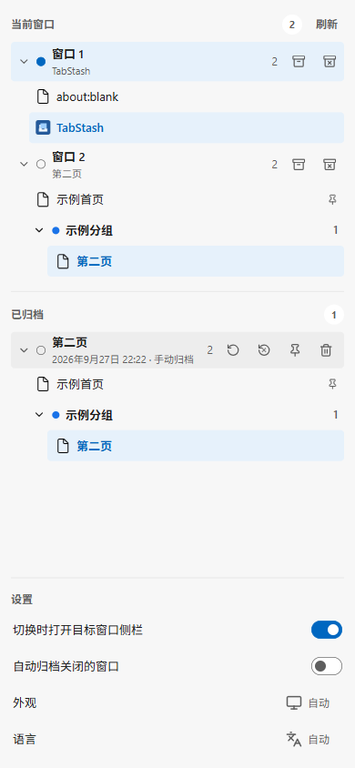
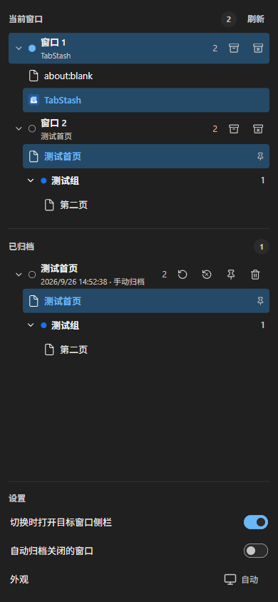

<p align="center"></p>

<h1 align="center">TabStash</h1>

<p align="center"><a href="./README.en.md">English</a> · 简体中文</p>

<p align="center">在浏览器侧栏整理窗口、归档标签，并从本机恢复。</p>

<p align="center">
  
  
  <a href="./LICENSE"></a>
</p>

TabStash 是面向 Microsoft Edge 和 Google Chrome 的侧栏扩展。它在一个窗口树中展示当前浏览器窗口、标签组和标签页，并将整个窗口归档到本机，供以后恢复。

归档保存标签顺序、固定状态、标签组、活动标签等信息；对于普通网页，还会尽力保存滚动位置和原生音视频的播放时间。所有归档均保存在浏览器本地，无需账号或云服务。

<p align="center">
  
  
</p>

<p align="center"><sub>Edge 浅色与深色界面。</sub></p>

## 功能

- **实时窗口树**：按窗口、标签组和标签页浏览；可激活标签和切换窗口。
- **窗口归档**：手动保存窗口，或保存后关闭窗口；自动归档关闭窗口的开关默认关闭。
- **归档管理**：查看、置顶、删除归档；恢复时可保留归档，或在窗口结构完整恢复后移除归档。
- **网页进度**：尽力恢复普通网页的主页面与内层滚动位置、原生 HTML 音视频播放时间；恢复后不会自动播放媒体。
- **侧栏外观与键盘操作**：Edge / Chrome 分别适配外观，支持自动、亮色和暗色模式，以及窗口树键盘导航。
- **多语言界面**：支持阿拉伯语、简体中文、英语、法语、俄语和西班牙语；默认跟随浏览器语言，也可在侧栏底部手动切换。

## 快速开始

需要 **Node.js 22+** 和 **pnpm 11**。在项目根目录安装依赖并构建目标浏览器版本：

```powershell
pnpm install --frozen-lockfile
pnpm build
pnpm build:chrome
```

然后在浏览器的扩展管理页开启**开发者模式**，选择**加载解压缩的扩展**：

| 浏览器 | 扩展管理页 | 加载目录 |
| --- | --- | --- |
| Microsoft Edge | `edge://extensions` | `.output/edge-mv3` |
| Google Chrome | `chrome://extensions` | `.output/chrome-mv3` |

加载后点击工具栏中的 TabStash 图标打开侧栏。修改开发版代码后，需重新构建并在扩展管理页点击重新加载才能载入新版本。归档保存在当前扩展实例的本地存储中，移除该实例可能清除数据。开发目录与生产目录可能对应不同的扩展 ID，各自的本地数据彼此独立。

## 使用说明

| 操作 | 说明 |
| --- | --- |
| 归档 | 点击窗口行的归档图标，保存当前窗口并保持窗口打开。 |
| 归档并关闭 | 保存成功后请求关闭原窗口；浏览器自身的关闭确认仍需用户处理。 |
| 自动归档 | 在侧栏底部“设置”中启用；使用关闭前最后一次成功保存的窗口快照。 |
| 恢复 | 在归档行选择“恢复”以保留原归档，或选择“恢复并移除”。后者仅在窗口结构完整恢复后删除原归档。 |
| 管理归档 | 可置顶、取消置顶或直接删除归档；删除后无法在扩展内撤销。 |

侧栏获得键盘焦点后，`Tab` / `Shift + Tab` 用于切换普通窗口；`F6` 进入设置等控件，`F6` 或 `Esc` 返回窗口树。窗口树内可用方向键及 `Home` / `End` 导航。

## 开发与验证

```powershell
pnpm dev:edge
pnpm dev:chrome
pnpm typecheck
pnpm lint
pnpm test
```

更新 README 截图时，先构建 Edge 扩展，再运行 `pnpm capture:readme`；脚本只使用隔离浏览器配置和本地测试页面。

如果 WXT 无法找到本机 Edge，可创建不提交的 `web-ext.config.ts`，通过 `binaries.edge` 指定浏览器可执行文件。该文件已列入 `.gitignore`。

端到端测试使用真实浏览器、隔离的浏览器配置目录和生产构建，需要可启动图形浏览器的 Windows 环境。先构建两种浏览器版本，再运行：

```powershell
pnpm install:chrome-test
pnpm test:e2e
```

`install:chrome-test` 下载固定版本的 Chrome for Testing 至被忽略的 `.tmp/`，并核对 SHA-256。GitHub Actions 工作流见 [`.github/workflows/ci.yml`](./.github/workflows/ci.yml)。

## 发布包

分别生成 Edge Add-ons 和 Chrome Web Store 使用的 ZIP：

```powershell
pnpm zip
pnpm zip:chrome
pnpm check:package
```

生成的文件名为 `.output/tabstash-<版本号>-edge.zip` 和 `.output/tabstash-<版本号>-chrome.zip`。`check:package` 检查两种浏览器的生产权限、入口、资源及 ZIP 文件头，并在 `.output/SHA256SUMS.txt` 中列出校验和。`.output/` 已被 Git 忽略；发布时可将两个 ZIP 和校验和作为 GitHub Release 附件上传，商店提交也使用对应浏览器的 ZIP。生产包不依赖开发服务器。

## 数据与权限

| 权限 | 用途 |
| --- | --- |
| `tabs`、`tabGroups` | 读取窗口中的标签与分组，并在恢复时重建结构。 |
| `sidePanel` | 从工具栏操作打开侧栏。 |
| `storage` | 保存设置、会话标识及短时操作状态。 |
| `favicon` | 获取浏览器页面图标。 |
| `<all_urls>` | 在顶层普通网页中记录滚动与原生媒体进度。 |

归档、窗口快照和网页进度保存在本机 IndexedDB；设置保存在浏览器扩展存储中。扩展不读取表单值、网页正文或登录凭据，也不向远程服务上传归档。网页进度仅针对可访问的普通网页，恢复后不会自动播放媒体。

## 项目结构

```text
TabStash/
├─ entrypoints/
│  ├─ background.ts             后台 Service Worker
│  ├─ page-progress.content.ts  网页进度内容脚本
│  └─ sidepanel/                React 侧栏入口及样式
├─ src/
│  ├─ application/              归档、恢复与实时窗口流程
│  ├─ domain/                   窗口树、快照等业务规则
│  ├─ infrastructure/           浏览器 API、消息、数据库与存储
│  ├─ runtime/                  窗口影子状态跟踪
│  └─ ui/                       侧栏组件与交互
├─ public/                     扩展图标、字体及资源授权文件
├─ tests/                      单元测试、浏览器测试与测试夹具
├─ scripts/                    图标生成、测试浏览器下载及产物检查
├─ doc/screenshots/            隔离浏览器中的界面截图
├─ .github/workflows/           CI 工作流
├─ CHANGELOG.md                 版本更新记录
└─ CONTRIBUTING.md              分支、贡献与提交规范
```

## 参与贡献

`master` 是稳定发布分支，日常开发在 `dev` 进行；普通 Pull Request 请提交到 `dev`，发布时再由 `dev` 合并到 `master`。提交问题或 Pull Request 前请阅读[贡献指南](./CONTRIBUTING.md)。用户可见变更记录在[更新日志](./CHANGELOG.md)；提交改动时请同步维护对应条目。

## 许可证

项目源码采用 [GNU Affero General Public License v3.0](./LICENSE)，SPDX 标识为 `AGPL-3.0-only`。随附字体和浏览器图标分别适用各自的授权文件，见 [Roboto 字体授权](./public/fonts/LICENSE-roboto.txt)、[Fluent 图标授权](./public/icons/browser/LICENSE-fluent.txt)和[Chromium 图标授权](./public/icons/browser/LICENSE-chromium.txt)。
